## AC_DangKy

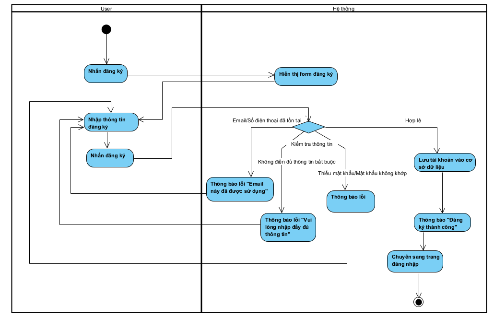

## AC_DangNhap

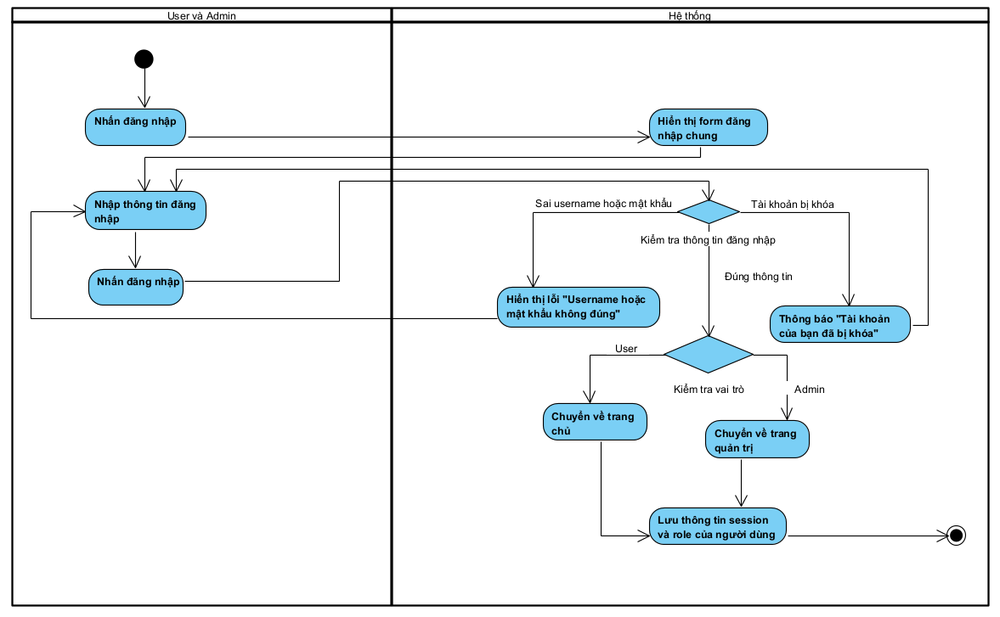

## AC_TimKiemVaLoc

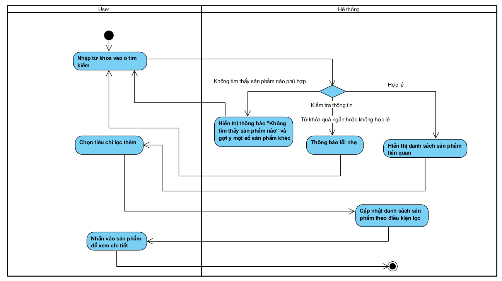

## AC_XemChiTietSanPham

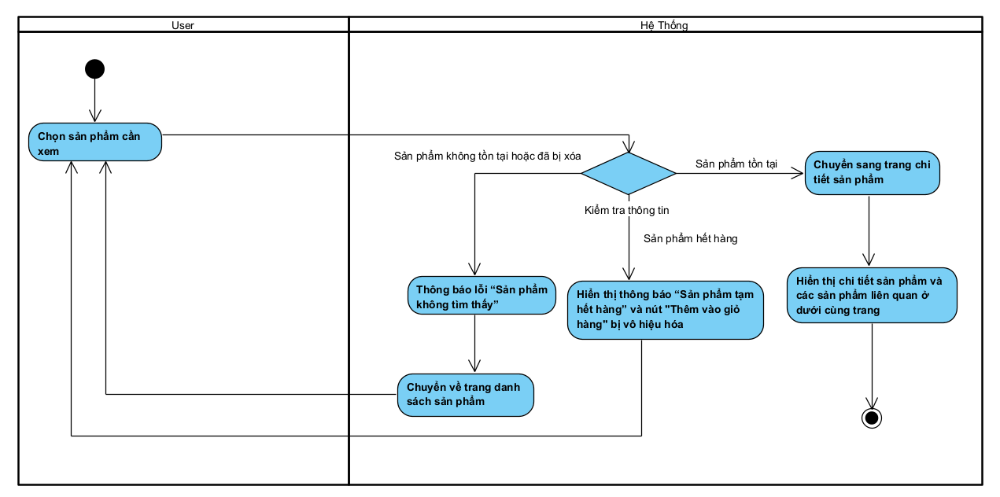

## AC_QuanLyGioHang

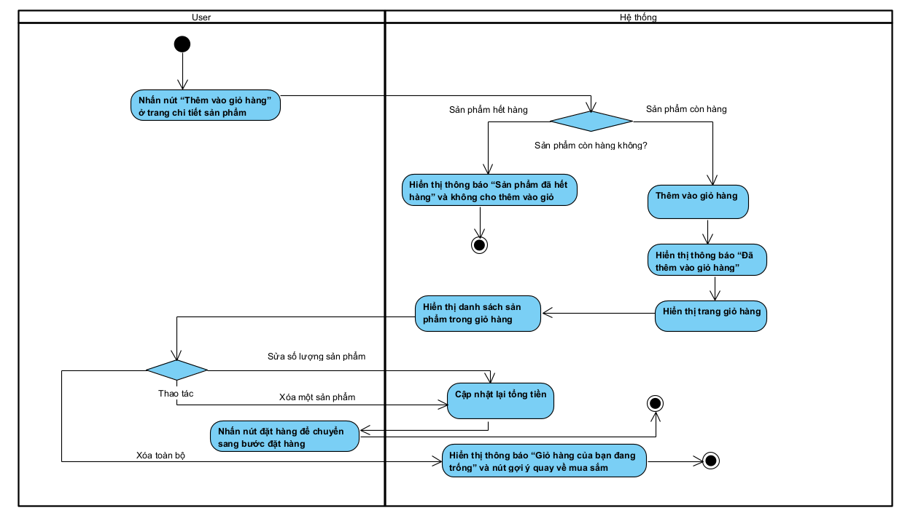

## AC_DatHang

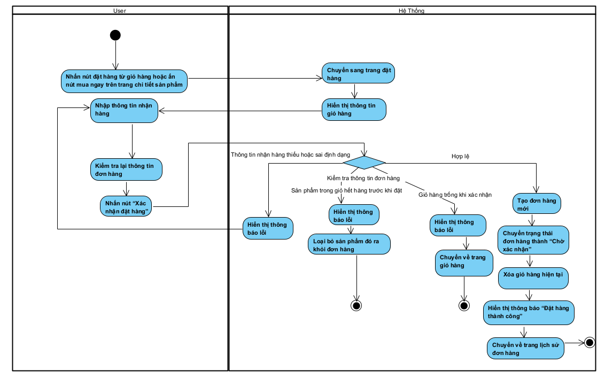

## AC_QuanLyDonHangUser

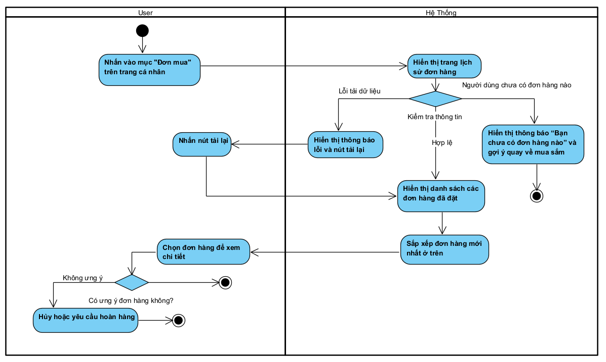

## AC_CapNhatHoSo

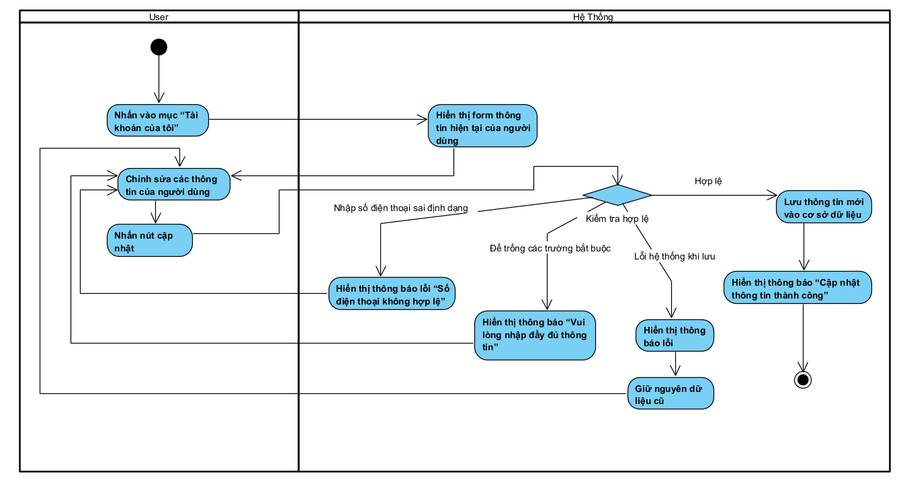

## AC_QuanLyNguoiDung

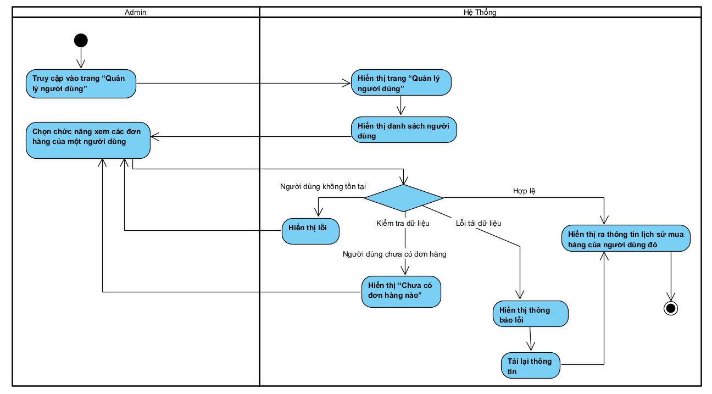

## AC_QuanLySanPham

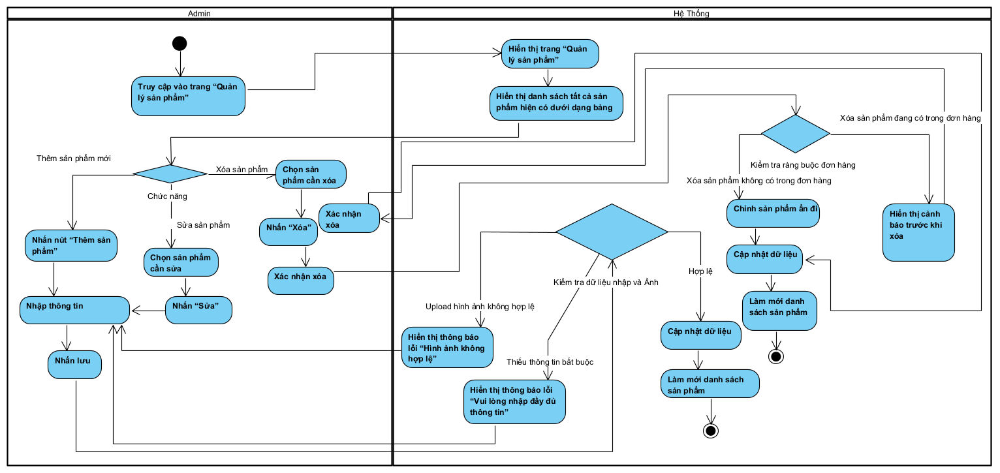

## AC_QuanLyDanhMuc

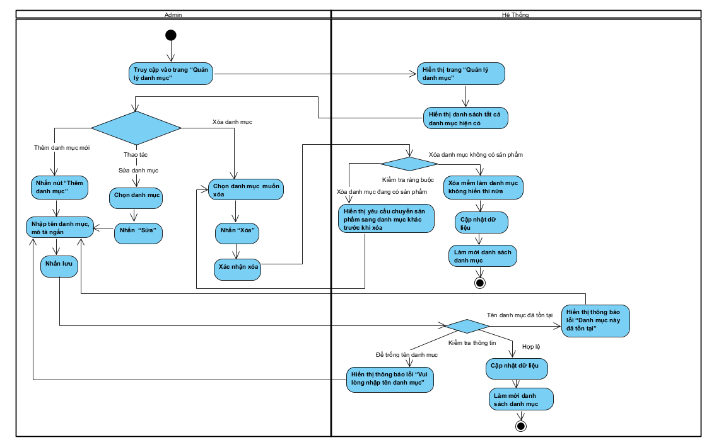

## AC_QuanLyDonHangAdmin

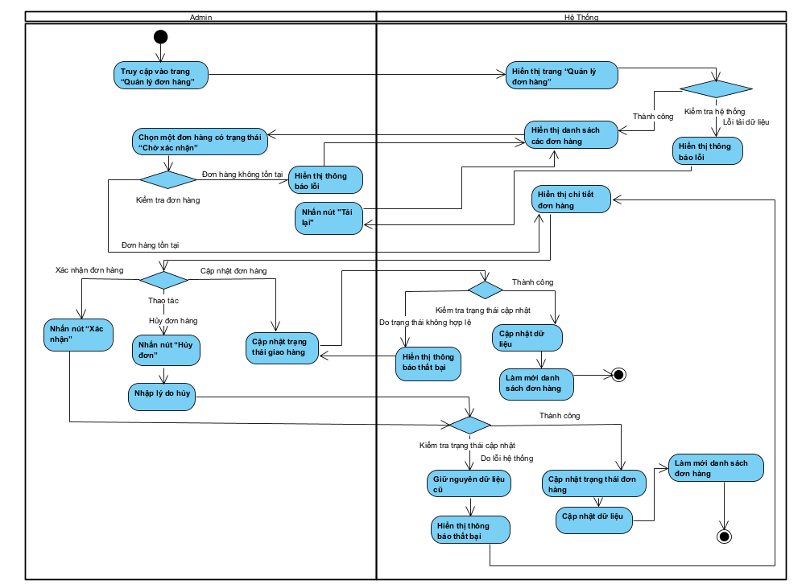

## AC_XemThongKeBaoCao

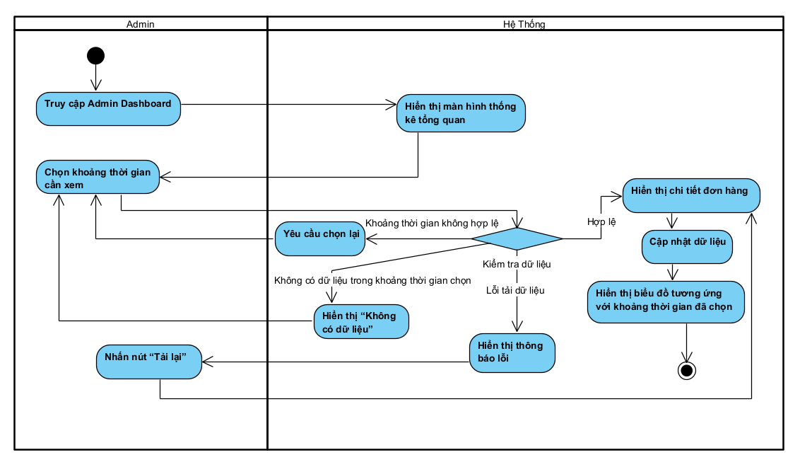
